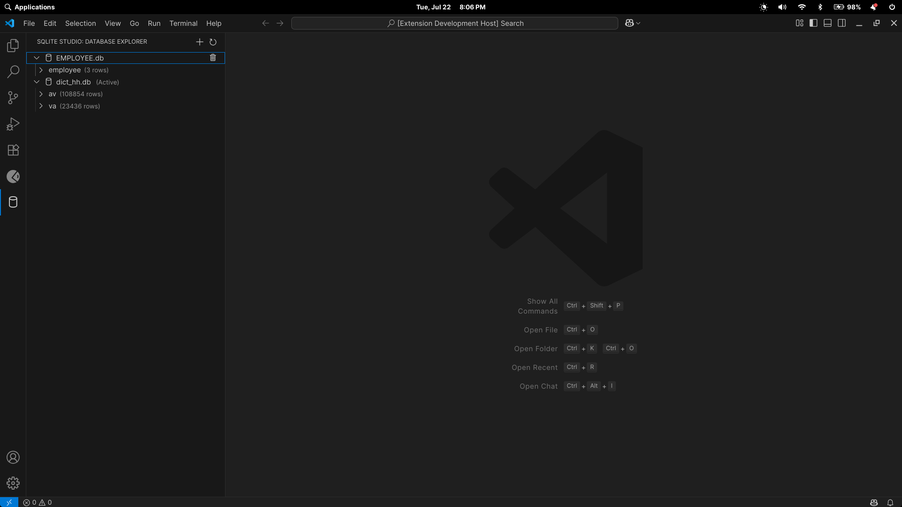
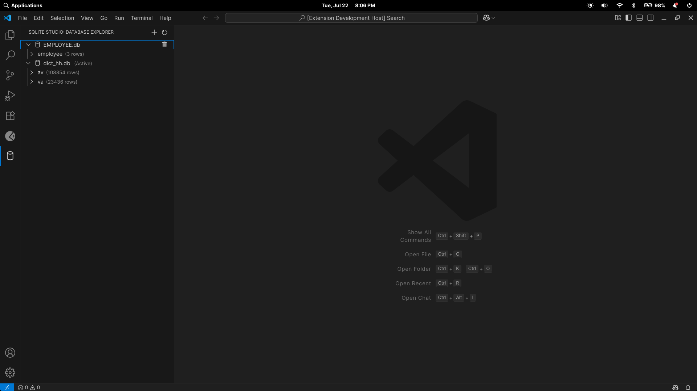
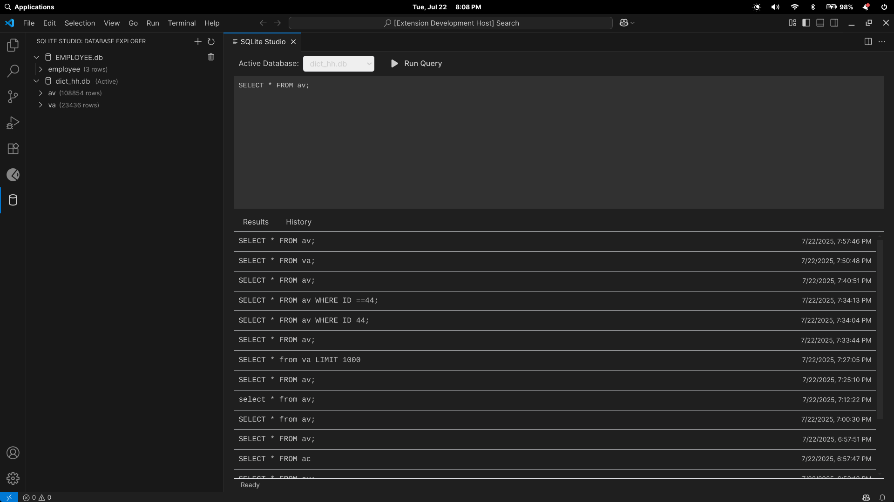

---

<h1 align="center">
  SQLite Studio for VS Code
</h1>
<p align="center">
A powerful, developer-friendly SQLite database manager directly inside Visual Studio Code.
<br />
SQLite Studio provides a beautiful and intuitive interface to connect to, query, and manage multiple SQLite databases without ever leaving your editor.
</p>

## ✨ Features

-   **Modern, Polished UI**: A beautiful and responsive interface built with Tailwind CSS that respects your VS Code theme.
-   **Multi-Database Management**: Connect to and seamlessly switch between multiple SQLite databases in your workspace.
-   **Powerful Database Explorer**:
    -   🗂️ View all connected databases in the sidebar.
    -   👀 Expand tables to see their schema, including column names, types, and primary keys.
    -   🔢 Instantly see the number of rows for each table.
    -   🖱️ One-click to view table data or remove a database connection.
-   **Advanced Editor & Results View**:
    -   ✍️ Write queries in a dedicated, resizable editor panel.
    -   🎯 **Run Selected Query**: Highlight a portion of your script and execute only that part.
    -   📄 **Full Result Pagination**: Automatically paginates `SELECT` results, allowing you to navigate millions of rows effortlessly with intuitive page controls (`< 1 2 3 ... N >`).
    -   ⏱️ See query metadata, including execution time and the number of rows returned.
-   **Robust & Performant**:
    -   💾 **1 GiB File Size Limit**: Gracefully handles large database files by preventing files over 1 GiB from being opened, ensuring editor stability.
    -   🧠 **Memory Efficient**: Only the visible page of results is loaded into memory, keeping the extension fast and responsive, regardless of table size.
-   **Full Query History**:
    -   📜 Every query you run is automatically saved to the History tab.
    -   🔄 View, search, and re-run previous queries with a single click.

## 🚀 Installation & Getting Started

### From the Marketplace

1.  Open the **Extensions** sidebar in VS Code (`Ctrl+Shift+X`).
2.  Search for `SQLite Studio`.
3.  Click **Install**.
4.  Click the **database icon** in the activity bar to open the SQLite Studio explorer.

### Quick Start

1.  In the SQLite Studio sidebar, click the **`+`** (Add Database) icon to add your first SQLite file.
2.  The main **SQLite Studio** editor will open automatically.
3.  The added database will be set as active. You can switch between databases using the **Active Database** dropdown.
4.  Write a query in the editor panel and click **Run Query** (or press `Ctrl+Enter` / `Cmd+Enter`).

## 📸 Screenshots

### Main Editor View
*The main editor provides a complete workspace for querying, viewing results, and navigating history. Notice the pagination controls in the footer of the results panel.*



| Database Explorer                                                                                                      | Query History                                                                                              |
| ---------------------------------------------------------------------------------------------------------------------- | ---------------------------------------------------------------------------------------------------------- |
| Browse schemas, view column types, and see row counts at a glance.                                                     | Never lose a query. View, search, and re-run any query you've executed.                                    |
|  |  |

---

## 🤝 Contributing

Contributions are what make the open-source community such an amazing place to learn, inspire, and create. Any contributions you make are **greatly appreciated**.

### Development Setup

1.  **Clone the repository:**
    ```bash
    git clone https://github.com/your-username/vscode-sqlite-studio.git
    cd vscode-sqlite-studio
    ```

2.  **Install dependencies:**
    ```bash
    npm install
    ```

3.  **Perform a clean compile:**
    ```bash
    npm run vscode:prepublish
    ```
    > **Note:** If you encounter issues, a clean rebuild is often the solution. Delete the `out` and `node_modules` directories, then run `npm install` and `npm run vscode:prepublish` again.

4.  **Start the extension:**
    -   Press `F5` in VS Code to open a new **Extension Development Host** window.
    -   This new window will be running your local version of the extension.

### How to Contribute

1.  **Open an Issue:** Before starting major work, please [open an issue](https://github.com/your-username/vscode-sqlite-studio/issues) to discuss your proposed changes.
2.  **Fork the Repository**
3.  **Create your Feature Branch** (`git checkout -b feature/AmazingFeature`)
4.  **Commit your Changes** (`git commit -m 'feat: Add some AmazingFeature'`)
5.  **Push to the Branch** (`git push origin feature/AmazingFeature`)
6.  **Open a Pull Request**

## 📝 License

This project is licensed under the MIT License. See the [LICENSE.md](LICENSE.md) file for details.